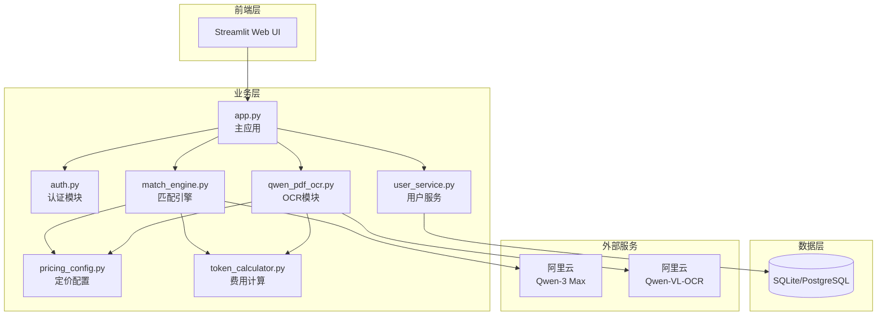
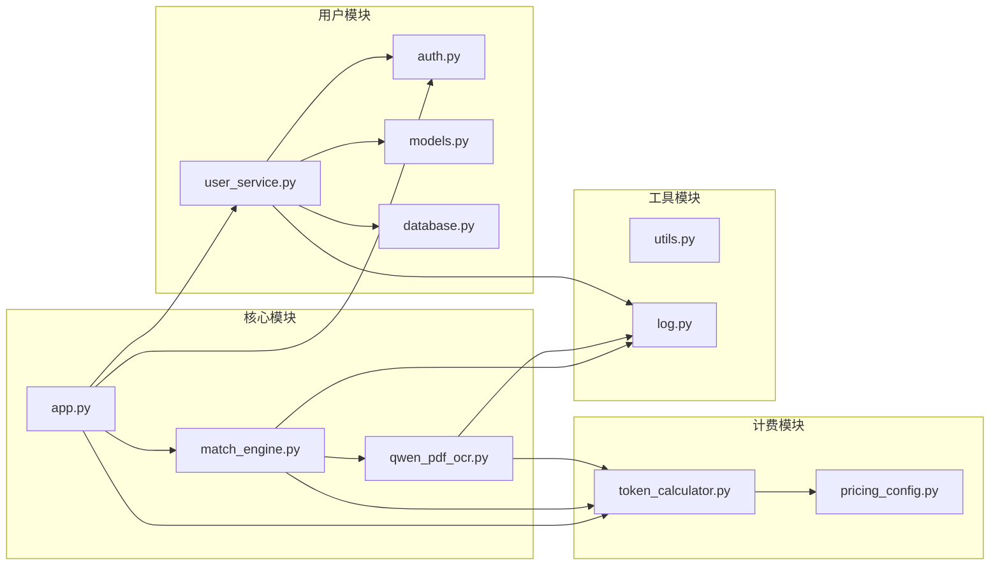
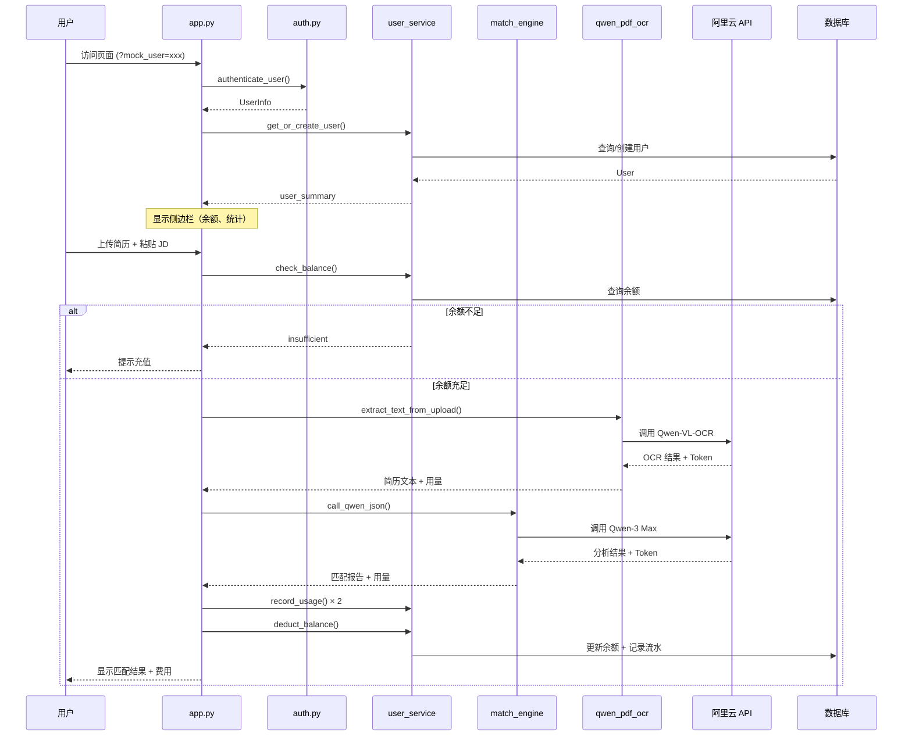

# 整体架构

HireStream Match 是一个基于 LLM 的智能简历匹配系统。

## 系统架构图



---

## 技术栈

| 层级 | 技术 | 版本 | 说明 |
|------|------|------|------|
| **前端** | Streamlit | 1.51 | 低代码 Web 应用框架 |
| **后端** | Python | 3.13 | 主语言 |
| **ORM** | SQLAlchemy | 2.0 | 数据库抽象层 |
| **数据库** | SQLite / PostgreSQL | - | 开发用 SQLite，生产用 PostgreSQL |
| **认证** | PyJWT | 2.x | JWT Token 处理 |
| **LLM** | Qwen-3 Max | - | JD-简历匹配分析 |
| **OCR** | Qwen-VL-OCR | - | PDF/图片文字识别 |
| **PDF** | PyMuPDF | - | PDF 渲染和处理 |
| **日志** | Loguru | - | 结构化日志 |
| **包管理** | UV | - | 快速依赖管理 |

---

## 模块依赖关系



---

## 核心流程

### 完整请求处理流程



---

## 目录结构

```
hirestream-match/
├── app.py                 # Streamlit 主应用入口
├── match_engine.py        # 核心匹配引擎
├── qwen_pdf_ocr.py       # PDF/图片 OCR 处理
├── utils.py              # 工具函数
├── log.py                # 日志配置
│
├── auth.py               # JWT 认证模块
├── user_service.py       # 用户服务层
├── models.py             # SQLAlchemy 模型
├── database.py           # 数据库连接
│
├── pricing_config.py     # 模型定价配置
├── token_calculator.py   # Token 费用计算
│
├── .env                  # 环境配置
├── pyproject.toml        # 项目依赖
├── Dockerfile            # Docker 配置
│
├── data/                 # 数据目录
│   └── hirestream.db    # SQLite 数据库
│
├── docs/                 # 项目文档
│   ├── architecture/    # 架构文档
│   ├── modules/         # 模块文档
│   ├── deployment/      # 部署文档
│   └── roadmap/         # 路线规划
│
└── logs/                 # 运行日志
```

---

## 相关文档

- [数据库设计](database.md)
- [认证流程](auth-flow.md)
- [用户模块](../modules/user.md)
- [计费定价](../modules/pricing.md)
