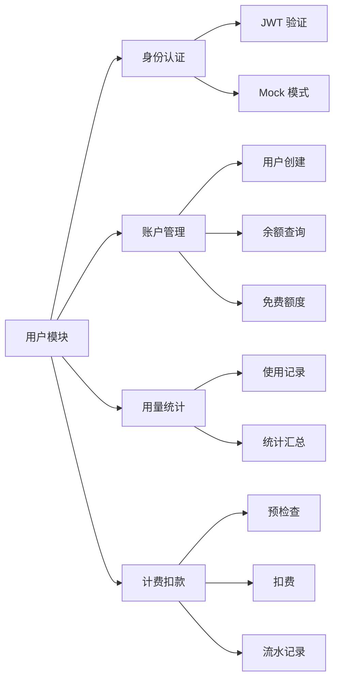
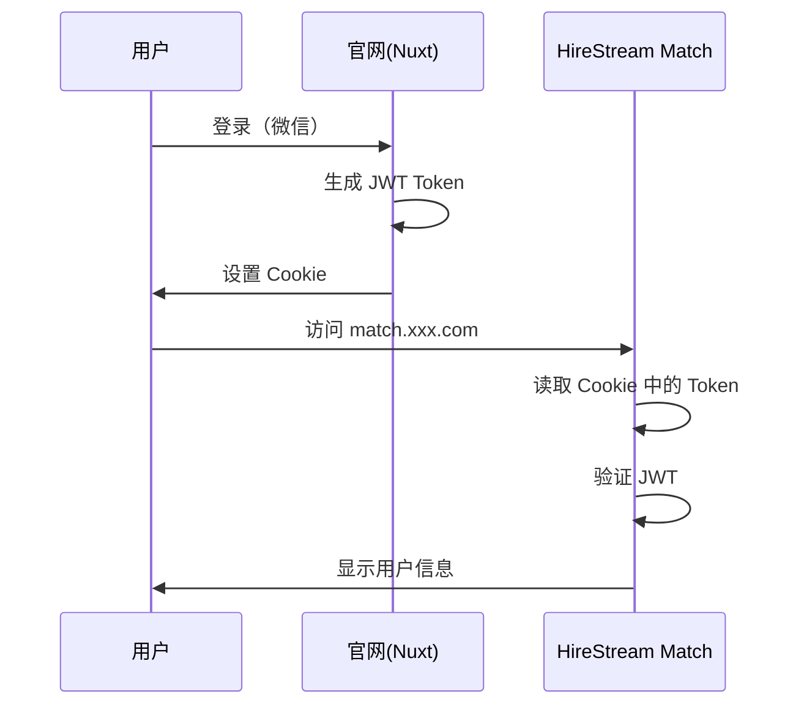

# 用户模块

用户模块负责身份认证、账户管理、用量统计和计费功能。

## 模块职责



---

## 文件结构

| 文件 | 说明 |
|------|------|
| `auth.py` | JWT Token 验证和 Mock 用户支持 |
| `user_service.py` | 用户业务逻辑：余额、扣费、记录 |
| `models.py` | 数据库模型定义 |
| `database.py` | 数据库连接管理 |

---

## 认证机制

### 支持的认证模式

| 模式 | 配置值 | 说明 | 使用场景 |
|------|--------|------|----------|
| Mock | `USER_AUTH_MODE=mock` | 模拟用户登录 | 开发测试 |
| JWT | `USER_AUTH_MODE=jwt` | JWT Token 验证 | 生产环境 |

### Mock 模式

访问时带上 `mock_user` 参数即可自动登录：

```
http://localhost:8501?mock_user=test_user_001
```

### JWT 模式

从 URL 参数或 Cookie 读取 Token：

```
http://localhost:8501?token=eyJhbGciOiJIUzI1NiIsInR5cCI6IkpXVCJ9...
```

**JWT Payload 结构：**
```json
{
  "user_id": "wx_openid_12345",
  "nickname": "张三",
  "avatar_url": "https://...",
  "iat": 1733558400,
  "exp": 1733644800
}
```

---

## 核心 API

### `auth.py`

```python
# 认证用户（根据配置自动选择模式）
user_info = authenticate_user(token=token, mock_id=mock_id)

# 验证 JWT Token
user_info = verify_jwt_token(token)

# 获取 Mock 用户
user_info = get_mock_user(mock_id)

# 生成 JWT Token（测试用）
token = generate_jwt_token(user_info, expires_in=86400)
```

### `user_service.py`

```python
service = get_user_service()

# 获取或创建用户
user = service.get_or_create_user(user_info)

# 检查余额
result = service.check_balance(user_id, estimated_cost=0.05)
if not result.sufficient:
    print(result.message)  # "余额不足..."

# 记录使用量
record = service.record_usage(
    user_id=user_id,
    request_id=request_id,
    operation="analysis",
    model="qwen3-max",
    prompt_tokens=1000,
    completion_tokens=200,
    cost=0.01
)

# 扣费
result = service.deduct_balance(
    user_id=user_id,
    cost=0.05,
    reference_id=request_id,
    remark="简历匹配分析"
)

# 获取用户概览
summary = service.get_user_summary(user_id)
```

---

## 余额管理

### 余额组成

```
可用余额 = 账户余额(balance) + 免费额度(free_quota)
```

### 扣费优先级

1. **优先扣免费额度**
2. **免费额度不足时，差额从余额扣除**
3. **余额不足时拒绝请求**

### 新用户免费额度

```python
# .env
DEFAULT_FREE_QUOTA=1.0  # 新用户免费额度（元）
```

---

## 使用统计

### 统计维度

| 维度 | 说明 |
|------|------|
| 今日调用次数 | 今日 0 点至今的调用数 |
| 今日消费金额 | 今日累计花费 |
| 今日 Token 消耗 | 今日输入+输出 Token 总数 |
| 历史总调用数 | 全部历史调用次数 |
| 历史总消费 | 全部历史花费 |

### 获取统计

```python
summary = service.get_user_summary(user_id)

# 返回示例
{
    "user_id": "test_user_001",
    "nickname": "测试用户",
    "balance": 0.0,
    "free_quota": 0.95,
    "total_available": 0.95,
    "today": {
        "count": 2,
        "cost": 0.05,
        "tokens": 3500
    },
    "total": {
        "count": 10,
        "cost": 0.25
    }
}
```

---

## 配置项

```bash
# .env

# JWT 配置
JWT_SECRET=your-secret-key          # JWT 签名密钥（与官网共享）
JWT_ALGORITHM=HS256                 # 签名算法

# 认证模式
USER_AUTH_MODE=mock                 # mock / jwt

# 免费额度
DEFAULT_FREE_QUOTA=1.0              # 新用户免费额度（元）

# 数据库
DATABASE_URL=sqlite:///./data/hirestream.db
```

---

## 与官网对接

### Phase 2 规划



**待实现：**
1. 官网生成 JWT Token
2. Cookie 跨子域共享
3. 未登录跳转官网登录页

---

## 相关文档

- [数据库设计](../architecture/database.md)
- [计费定价](pricing.md)
- [认证流程](../architecture/auth-flow.md)
